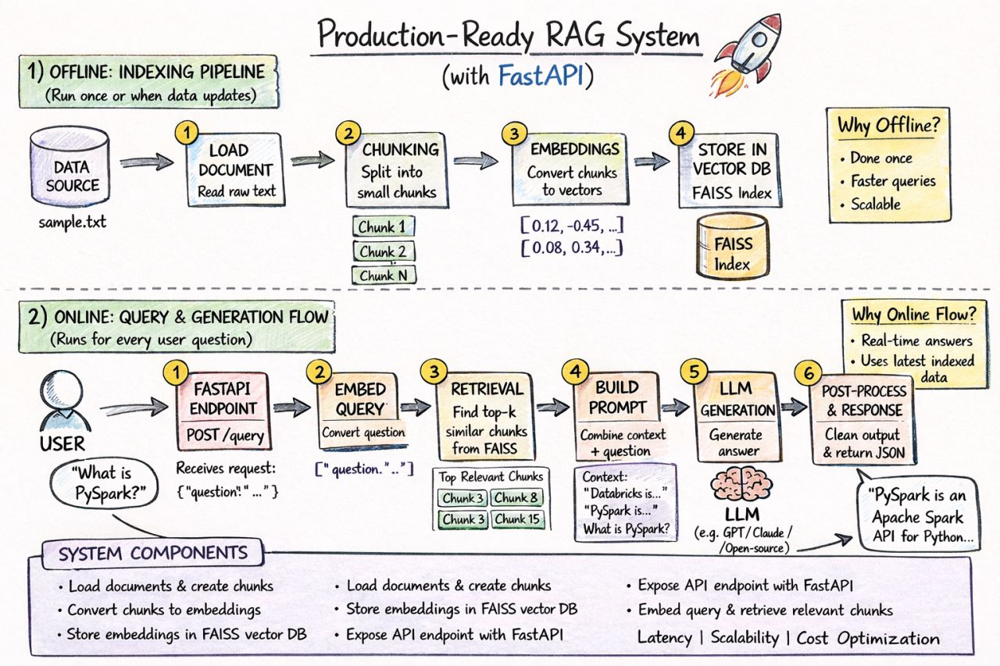

# 🚀 RAG Chat System (FastAPI + FAISS + OpenAI)


---

## 🔥 Overview
This project implements a Retrieval-Augmented Generation (RAG) system that enables context-aware question answering over custom documents.

Instead of relying solely on LLM knowledge, the system retrieves relevant document chunks using FAISS and generates grounded responses using OpenAI.

---

## 🏗️ Architecture



### 🔄 Flow
User → FastAPI → Query Embedding → FAISS Retrieval → Context Injection → LLM → Response

---

## 🚀 Features

- 📄 Document ingestion & chunking  
- 🔍 Semantic search using FAISS vector database  
- 🧠 Context-aware response generation  
- 📌 Source attribution (grounded answers)  
- ⚡ Latency tracking for performance monitoring  
- 🔗 FastAPI-based REST API  

---

## 🛠 Tech Stack

- Python  
- FastAPI  
- LangChain  
- FAISS (Vector Database)  
- OpenAI  
- Pydantic  

---

## ⚙️ Setup

```bash
git clone https://github.com/pawannal/rag-chat-system.git
cd rag-chat-system

python -m venv venv
source venv/bin/activate

pip install -r requirements.txt
